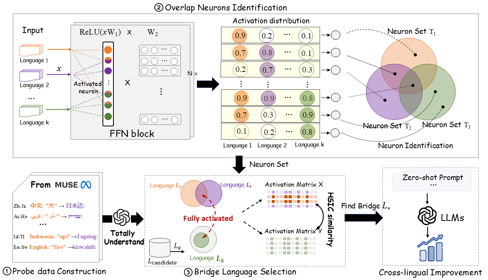

# Linguistic Neuron Overlap Patterns to Facilitate Cross-lingual Transfer on Low-resource Languages




### Linguistic Similarity
```bash
python flores_activation.py -l zh
python language_similarity.py
```

### Bridge Language Selection
```bash
python probe_activation.py --src_lang zh --trg_lang ja
python bridge.py --src_lang zh --trg_lang ja
